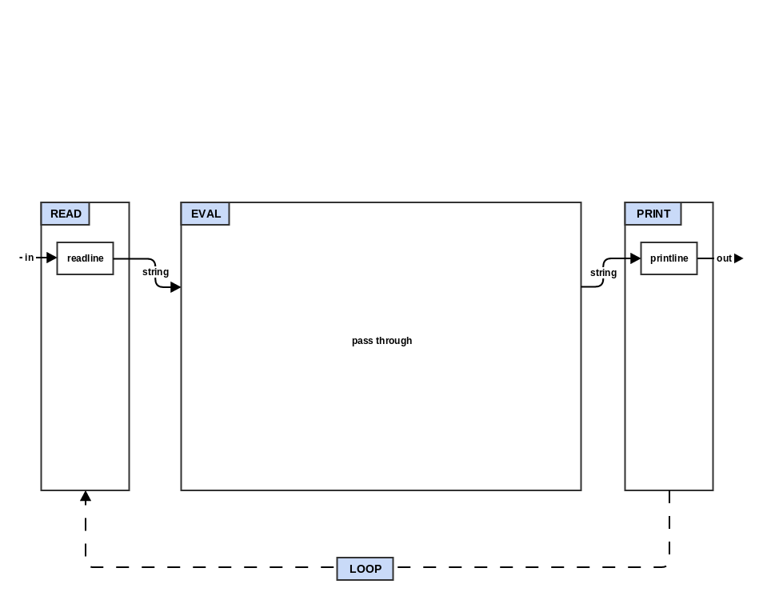

### Step 0: The REPL



This step is basically just creating a skeleton of your interpreter.

* Create a `step0_repl.qx` file in `quux/`.

* Add the 4 trivial functions `READ`, `EVAL`, `PRINT`, and `rep`
  (read-eval-print). `READ`, `EVAL`, and `PRINT` are basically just
  stubs that return their first parameter (a string if your target
  language is a statically typed) and `rep` calls them in order
  passing the return to the input of the next.

* Add a main loop that repeatedly prints a prompt (needs to be
  "user> " for later tests to pass), gets a line of input from the
  user, calls `rep` with that line of input, and then prints out the
  result from `rep`. It should also exit when you send it an EOF
  (often Ctrl-D).

* If you are using a compiled (ahead-of-time rather than just-in-time)
  language, then create a Makefile (or appropriate project definition
  file) in your directory.

It is time to run your first tests. This will check that your program
does input and output in a way that can be captured by the test
harness. Go to the top level and run the following:
```
make "test^quux^step0"
```

Add and then commit your new `step0_repl.qx` and `Makefile` to git.

Congratulations! You have just completed the first step of the
make-a-lisp process.


#### Optional:

* Add full line editing and command history support to your
  interpreter REPL. Many languages have a library/module that provide
  line editing support. Another option if your language supports it is
  to use an FFI (foreign function interface) to load and call directly
  into GNU readline, editline, or linenoise library. Add line
  editing interface code to `readline.qx`

