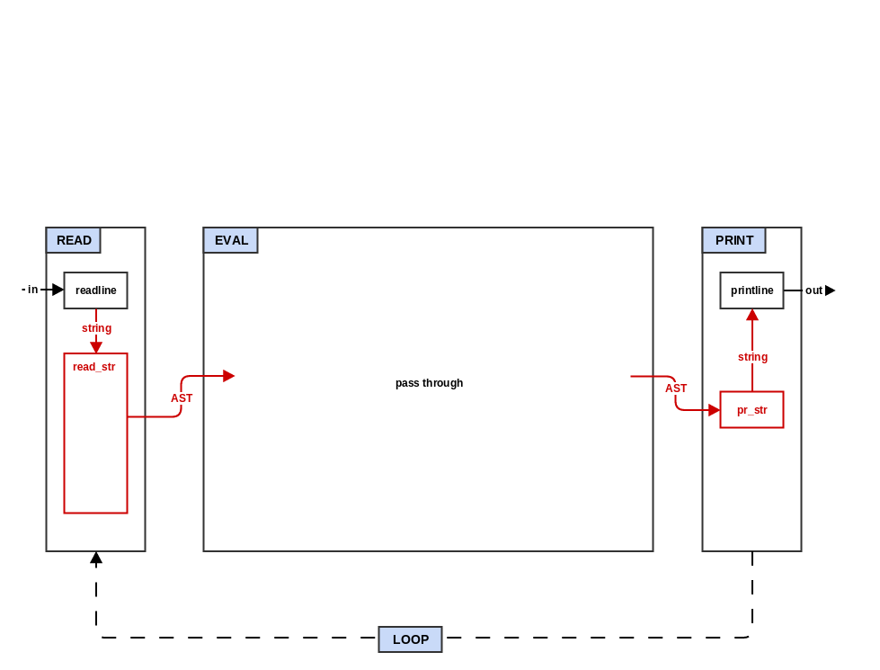

# Step 1: Read and Print



In this step, your interpreter will "read" the string from the user
and parse it into an internal tree data structure (an abstract syntax
tree) and then take that data structure and "print" it back to
a string.

In non-lisp languages, this step (called "lexing and parsing") can be
one of the most complicated parts of the compiler/interpreter. In
Lisp, the data structure that you want in memory is basically
represented directly in the code that the programmer writes
(homoiconicity).

For example, if the string is "(+ 2 (* 3 4))" then the read function
will process this into a tree structure that looks like this:
```
          List
         / |  \
        /  |   \
       /   |    \
  Sym:+  Int:2  List
               / |  \
              /  |   \
             /   |    \
         Sym:*  Int:3  Int:4
```

Each left paren and its matching right paren (lisp "sexpr") becomes
a node in the tree and everything else becomes a leaf in the tree.

If you can find code for an implementation of a JSON encoder/decoder
in your target language then you can probably just borrow and modify
that and be 75% of the way done with this step.

The rest of this section is going to assume that you are not starting
from an existing JSON encoder/decoder, but that you do have access to
a Perl compatible regular expressions (PCRE) module/library. You can
certainly implement the reader using simple string operations, but it
is more involved. The `make`, `ps` (postscript) and Haskell
implementations have examples of a reader/parser without using regular
expression support.

* Copy `step0_repl.qx` to `step1_read_print.qx`.

* Add a `reader.qx` file to hold functions related to the reader.

* If the target language has objects types (OOP), then the next step
  is to create a simple stateful Reader object in `reader.qx`. This
  object will store the tokens and a position. The Reader object will
  have two methods: `next` and `peek`. `next` returns the token at
  the current position and increments the position. `peek` just
  returns the token at the current position.

* Add a function `read_str` in `reader.qx`. This function
  will call `tokenize` and then create a new Reader object instance
  with the tokens. Then it will call `read_form` with the Reader
  instance.

* Add a function `tokenize` in `reader.qx`. This function will take
  a single string and return an array/list
  of all the tokens (strings) in it. The following regular expression
  (PCRE) will match all mal tokens.
```
[\s,]*(~@|[\[\]{}()'`~^@]|"(?:\\.|[^\\"])*"?|;.*|[^\s\[\]{}('"`,;)]*)
```
* For each match captured within the parenthesis starting at char 6 of the
  regular expression a new token will be created.

  * `[\s,]*`: Matches any number of whitespaces or commas. This is not captured
    so it will be ignored and not tokenized.

  * `~@`: Captures the special two-characters `~@` (tokenized).

  * ```[\[\]{}()'`~^@]```: Captures any special single character, one of
    ```[]{}()'`~^@``` (tokenized).

  * `"(?:\\.|[^\\"])*"?`: Starts capturing at a double-quote and stops at the
    next double-quote unless it was preceded by a backslash in which case it
    includes it until the next double-quote (tokenized). It will also
    match unbalanced strings (no ending double-quote) which should be
    reported as an error.

  * `;.*`: Captures any sequence of characters starting with `;` (tokenized).

  * ```[^\s\[\]{}('"`,;)]*```: Captures a sequence of zero or more non special
    characters (e.g. symbols, numbers, "true", "false", and "nil") and is sort
    of the inverse of the one above that captures special characters (tokenized).

* Add the function `read_form` to `reader.qx`. This function
  will peek at the first token in the Reader object and switch on the
  first character of that token. If the character is a left paren then
  `read_list` is called with the Reader object. Otherwise, `read_atom`
  is called with the Reader Object. The return value from `read_form`
  is a mal data type. If your target language is statically typed then
  you will need some way for `read_form` to return a variant or
  subclass type. For example, if your language is object oriented,
  then you can define a top level MalType (in `types.qx`) that all
  your mal data types inherit from. The MalList type (which also
  inherits from MalType) will contain a list/array of other MalTypes.
  If your language is dynamically typed then you can likely just
  return a plain list/array of other mal types.

* Add the function `read_list` to `reader.qx`. This function will
  repeatedly call `read_form` with the Reader object until it
  encounters a ')' token (if it reach EOF before reading a ')' then
  that is an error). It accumulates the results into a List type.  If
  your language does not have a sequential data type that can hold mal
  type values you may need to implement one (in `types.qx`).  Note
  that `read_list` repeatedly calls `read_form` rather than
  `read_atom`. This mutually recursive definition between `read_list`
  and `read_form` is what allows lists to contain lists.

* Add the function `read_atom` to `reader.qx`. This function will
  look at the contents of the token and return the appropriate scalar
  (simple/single) data type value. Initially, you can just implement
  numbers (integers) and symbols. This will allow you to proceed
  through the next couple of steps before you will need to implement
  the other fundamental mal types: nil, true, false, and string. The
  remaining scalar mal type, keyword does not
  need to be implemented until step A (but can be implemented at any
  point between this step and that). BTW, symbols types are just an
  object that contains a single string name value (some languages have
  symbol types already).

* Add a file `printer.qx`. This file will contain a single function
  `pr_str` which does the opposite of `read_str`: take a mal data
  structure and return a string representation of it. But `pr_str` is
  much simpler and is basically just a switch statement on the type of
  the input object:

  * symbol: return the string name of the symbol
  * number: return the number as a string
  * list: iterate through each element of the list calling `pr_str` on
    it, then join the results with a space separator, and surround the
    final result with parens

* Change the `READ` function in `step1_read_print.qx` to call
  `reader.read_str` and the `PRINT` function to call `printer.pr_str`.
  `EVAL` continues to simply return its input but the type is now
  a mal data type.

You now have enough hooked up to begin testing your code. You can
manually try some simple inputs:
  * `123` -> `123`
  * `   123  ` -> `123`
  * `abc` -> `abc`
  * `   abc   ` -> `abc`
  * `(123 456)` -> `(123 456)`
  * `(  123   456 789   )   ` -> `(123 456 789)`
  * `(  + 2   (*  3  4)  )  ` -> `(+ 2 (* 3 4))`

To verify that your code is doing more than just eliminating extra
spaces (and not failing), you can instrument your `reader.qx` functions.

Once you have gotten past those simple manual tests, it is time to run
the full suite of step 1 tests. Go to the top level and run the
following:
```
make "test^quux^step1"
```

Fix any test failures related to symbols, numbers and lists.

Depending on the functionality of your target language, it is likely
that you have now just completed one of the most difficult steps. It
is down hill from here. The remaining steps will probably be easier
and each step will give progressively more bang for the buck.

#### Deferrable:


* Add support for the other basic data type to your reader and printer
  functions: string, nil, true, and false. Nil, true, and false
  become mandatory at step 4, strings at step 6. When a string is read,
  the following transformations are
  applied: a backslash followed by a doublequote is translated into
  a plain doublequote character, a backslash followed by "n" is
  translated into a newline, and a backslash followed by another
  backslash is translated into a single backslash. To properly print
  a string (for step 4 string functions), the `pr_str` function needs
  another parameter called `print_readably`.  When `print_readably` is
  true, doublequotes, newlines, and backslashes are translated into
  their printed representations (the reverse of the reader). The
  `PRINT` function in the main program should call `pr_str` with
  print_readably set to true.

* Add error checking to your reader functions to make sure parens
  are properly matched. Catch and print these errors in your main
  loop. If your language does not have try/catch style bubble up
  exception handling, then you will need to add explicit error
  handling to your code to catch and pass on errors without crashing.

* Add support for reader macros which are forms that are
  transformed into other forms during the read phase. Refer to
  `tests/step1_read_print.mal` for the form that these macros should
  take (they are just simple transformations of the token stream).

* Add support for the other mal types: keyword, vector, hash-map.
  * keyword: a keyword is a token that begins with a colon. A keyword
    can just be stored as a string with special unicode prefix like
    0x29E (or char 0xff/127 if the target language does not have good
    unicode support) and the printer translates strings with that
    prefix back to the keyword representation. This makes it easy to
    use keywords as hash map keys in most languages. You can also
    store keywords as a unique data type, but you will need to make
    sure they can be used as hash map keys (which may involve doing
    a similar prefixed translation anyways).
  * vector: a vector can be implemented with same underlying
    type as a list as long as there is some mechanism to keep track of
    the difference. You can use the same reader function for both
    lists and vectors by adding parameters for the starting and ending
    tokens.
  * hash-map: a hash-map is an associative data structure that maps
    strings to other mal values. If you implement keywords as prefixed
    strings, then you only need a native associative data structure
    which supports string keys. Clojure allows any value to be a hash
    map key, but the base functionality in mal is to support strings
    and keyword keys. Because of the representation of hash-maps as
    an alternating sequence of keys and values, you can probably use
    the same reader function for hash-maps as lists and vectors with
    parameters to indicate the starting and ending tokens. The odd
    tokens are then used for keys with the corresponding even tokens
    as the values.

* Add comment support to your reader. The tokenizer should ignore
  tokens that start with ";". Your `read_str` function will need to
  properly handle when the tokenizer returns no values. The simplest
  way to do this is to return `nil` mal value. A cleaner option (that
  does not print `nil` at the prompt is to throw a special exception
  that causes the main loop to simply continue at the beginning of the
  loop without calling `rep`.

