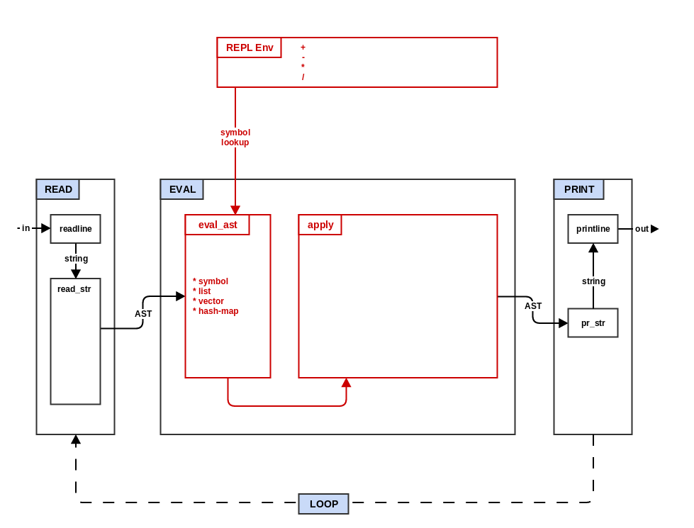

# Step 2: Eval



In step 1 your mal interpreter was basically just a way to validate
input and eliminate extraneous white space. In this step you will turn
your interpreter into a simple number calculator by adding
functionality to the evaluator (`EVAL`).

Compare the pseudocode for step 1 and step 2 to get a basic idea of
the changes that will be made during this step:
```
diff -urp ../process/step1_read_print.txt ../process/step2_eval.txt
```

* Copy `step1_read_print.qx` to `step2_eval.qx`.

* Define a simple initial REPL environment. This environment is an
  associative structure that maps symbols (or symbol names) to
  numeric functions. For example, in python this would look something
  like this:
```
repl_env = {'+': lambda a,b: a+b,
            '-': lambda a,b: a-b,
            '*': lambda a,b: a*b,
            '/': lambda a,b: int(a/b)}
```

* Modify the `rep` function to pass the REPL environment as the second
  parameter for the `EVAL` call.

* Create a new function `eval_ast` which takes `ast` (mal data type)
  and an associative structure (the environment from above).
  `eval_ast` switches on the type of `ast` as follows:

  * symbol: lookup the symbol in the environment structure and return
    the value or raise an error if no value is found
  * list: return a new list that is the result of calling `EVAL` on
    each of the members of the list
  * otherwise just return the original `ast` value

* Modify `EVAL` to check if the first parameter `ast` is a list.
  * `ast` is not a list: then return the result of calling `eval_ast`
    on it.
  * `ast` is a empty list: return ast unchanged.
  * `ast` is a list: call `eval_ast` to get a new evaluated list. Take
    the first item of the evaluated list and call it as function using
    the rest of the evaluated list as its arguments.

If your target language does not have full variable length argument
support (e.g. variadic, vararg, splats, apply) then you will need to
pass the full list of arguments as a single parameter and split apart
the individual values inside of every mal function. This is annoying,
but workable.

The process of taking a list and invoking or executing it to return
something new is known in Lisp as the "apply" phase.

Try some simple expressions:

  * `(+ 2 3)` -> `5`
  * `(+ 2 (* 3 4))` -> `14`

The most likely challenge you will encounter is how to properly call
a function references using an arguments list.

Now go to the top level, run the step 2 tests and fix the errors.
```
make "test^quux^step2"
```

You now have a simple prefix notation calculator!

#### Deferrable:

* `eval_ast` should evaluate elements of vectors and hash-maps.  Add the
  following cases in `eval_ast`:
  * If `ast` is a vector: return a new vector that is the result of calling
    `EVAL` on each of the members of the vector.
  * If `ast` is a hash-map: return a new hash-map which consists of key-value
    pairs where the key is a key from the hash-map and the value is the result
    of calling `EVAL` on the corresponding value.


<a name="step3"></a>
