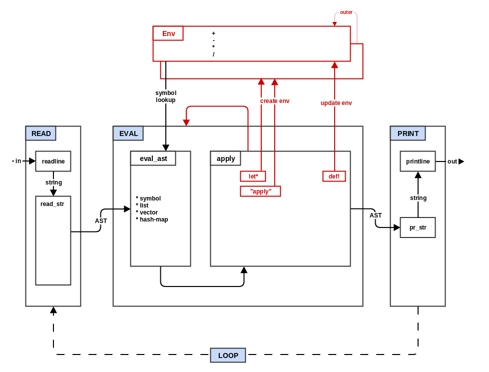

### Step 3: Environments



In step 2 you were already introduced to REPL environment (`repl_env`)
where the basic numeric functions were stored and looked up. In this
step you will add the ability to create new environments (`let*`) and
modify existing environments (`def!`).

A Lisp environment is an associative data structure that maps symbols (the
keys) to values. But Lisp environments have an additional important
function: they can refer to another environment (the outer
environment). During environment lookups, if the current environment
does not have the symbol, the lookup continues in the outer
environment, and continues this way until the symbol is either found,
or the outer environment is `nil` (the outermost environment in the
chain).

Compare the pseudocode for step 2 and step 3 to get a basic idea of
the changes that will be made during this step:
```
diff -urp ../process/step2_eval.txt ../process/step3_env.txt
```

* Copy `step2_eval.qx` to `step3_env.qx`.

* Create `env.qx` to hold the environment definition.

* Define an `Env` object that is instantiated with a single `outer`
  parameter and starts with an empty associative data structure
  property `data`.

* Define three methods for the Env object:
  * set: takes a symbol key and a mal value and adds to the `data`
    structure
  * find: takes a symbol key and if the current environment contains
    that key then return the environment. If no key is found and outer
    is not `nil` then call find (recurse) on the outer environment.
  * get: takes a symbol key and uses the `find` method to locate the
    environment with the key, then returns the matching value. If no
    key is found up the outer chain, then throws/raises a "not found"
    error.

* Update `step3_env.qx` to use the new `Env` type to create the
  repl_env (with a `nil` outer value) and use the `set` method to add
  the numeric functions.

* Modify `eval_ast` to call the `get` method on the `env` parameter.

* Modify the apply section of `EVAL` to switch on the first element of
  the list:
  * symbol "def!": call the set method of the current environment
    (second parameter of `EVAL` called `env`) using the unevaluated
    first parameter (second list element) as the symbol key and the
    evaluated second parameter as the value.
  * symbol "let\*": create a new environment using the current
    environment as the outer value and then use the first parameter as
    a list of new bindings in the "let\*" environment. Take the second
    element of the binding list, call `EVAL` using the new "let\*"
    environment as the evaluation environment, then call `set` on the
    "let\*" environment using the first binding list element as the key
    and the evaluated second element as the value. This is repeated
    for each odd/even pair in the binding list. Note in particular,
    the bindings earlier in the list can be referred to by later
    bindings. Finally, the second parameter (third element) of the
    original `let*` form is evaluated using the new "let\*" environment
    and the result is returned as the result of the `let*` (the new
    let environment is discarded upon completion).
  * otherwise: call `eval_ast` on the list and apply the first element
    to the rest as before.

`def!` and `let*` are Lisp "specials" (or "special atoms") which means
that they are language level features and more specifically that the
rest of the list elements (arguments) may be evaluated differently (or
not at all) unlike the default apply case where all elements of the
list are evaluated before the first element is invoked. Lists which
contain a "special" as the first element are known as "special forms".
They are special because they follow special evaluation rules.

Try some simple environment tests:

  * `(def! a 6)` -> `6`
  * `a` -> `6`
  * `(def! b (+ a 2))` -> `8`
  * `(+ a b)` -> `14`
  * `(let* (c 2) c)` -> `2`

Now go to the top level, run the step 3 tests and fix the errors.
```
make "test^quux^step3"
```

You mal implementation is still basically just a numeric calculator
with save/restore capability. But you have set the foundation for step
4 where it will begin to feel like a real programming language.


An aside on mutation and typing:

The "!" suffix on symbols is used to indicate that this symbol refers
to a function that mutates something else. In this case, the `def!`
symbol indicates a special form that will mutate the current
environment. Many (maybe even most) of runtime problems that are
encountered in software engineering are a result of mutation. By
clearly marking code where mutation may occur, you can more easily
track down the likely cause of runtime problems when they do occur.

Another cause of runtime errors is type errors, where a value of one
type is unexpectedly treated by the program as a different and
incompatible type. Statically typed languages try to make the
programmer solve all type problems before the program is allowed to
run. Most Lisp variants tend to be dynamically typed (types of values
are checked when they are actually used at runtime).

As an aside-aside: The great debate between static and dynamic typing
can be understood by following the money. Advocates of strict static
typing use words like "correctness" and "safety" and thus get
government and academic funding. Advocates of dynamic typing use words
like "agile" and "time-to-market" and thus get venture capital and
commercial funding.
