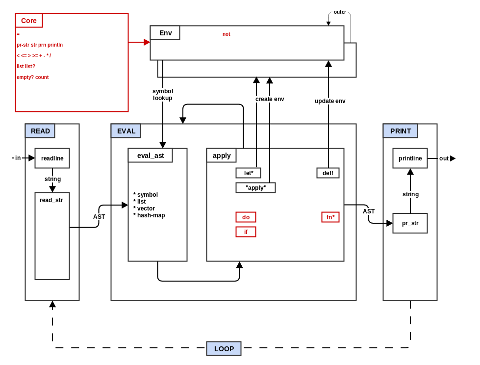

### Step 4: If Fn Do



In step 3 you added environments and the special forms for
manipulating environments. In this step you will add 3 new special
forms (`if`, `fn*` and `do`) and add several more core functions to
the default REPL environment. Our new architecture will look like
this:

The `fn*` special form is how new user-defined functions are created.
In some Lisps, this special form is named "lambda".

Compare the pseudocode for step 3 and step 4 to get a basic idea of
the changes that will be made during this step:
```
diff -urp ../process/step3_env.txt ../process/step4_if_fn_do.txt
```

* Copy `step3_env.qx` to `step4_if_fn_do.qx`.

* If you have not implemented reader and printer support (and data
  types) for `nil`, `true` and `false`, you will need to do so for
  this step.

* Update the constructor/initializer for environments to take two new
  arguments: `binds` and `exprs`. Bind (`set`) each element (symbol)
  of the binds list to the respective element of the `exprs` list.

* Add support to `printer.qx` to print functions values. A string
  literal like "#\<function>" is sufficient.

* Add the following special forms to `EVAL`:

  * `do`: Evaluate all the elements of the list using `eval_ast`
    and return the final evaluated element.
  * `if`: Evaluate the first parameter (second element). If the result
    (condition) is anything other than `nil` or `false`, then evaluate
    the second parameter (third element of the list) and return the
    result.  Otherwise, evaluate the third parameter (fourth element)
    and return the result. If condition is false and there is no third
    parameter, then just return `nil`.
  * `fn*`: Return a new function closure. The body of that closure
    does the following:
    * Create a new environment using `env` (closed over from outer
      scope) as the `outer` parameter, the first parameter (second
      list element of `ast` from the outer scope) as the `binds`
      parameter, and the parameters to the closure as the `exprs`
      parameter.
    * Call `EVAL` on the second parameter (third list element of `ast`
      from outer scope), using the new environment. Use the result as
      the return value of the closure.

If your target language does not support closures, then you will need
to implement `fn*` using some sort of structure or object that stores
the values being closed over: the first and second elements of the
`ast` list (function parameter list and function body) and the current
environment `env`. In this case, your native functions will need to be
wrapped in the same way. You will probably also need a method/function
that invokes your function object/structure for the default case of
the apply section of `EVAL`.

Try out the basic functionality you have implemented:

  * `(fn* (a) a)` -> `#<function>`
  * `( (fn* (a) a) 7)` -> `7`
  * `( (fn* (a) (+ a 1)) 10)` -> `11`
  * `( (fn* (a b) (+ a b)) 2 3)` -> `5`

* Add a new file `core.qx` and define an associative data structure
  `ns` (namespace) that maps symbols to functions. Move the numeric
  function definitions into this structure.

* Modify `step4_if_fn_do.qx` to iterate through the `core.ns`
  structure and add (`set`) each symbol/function mapping to the
  REPL environment (`repl_env`).

* Add the following functions to `core.ns`:
  * `prn`: call `pr_str` on the first parameter with `print_readably`
    set to true, prints the result to the screen and then return
    `nil`. Note that the full version of `prn` is a deferrable below.
  * `list`: take the parameters and return them as a list.
  * `list?`: return true if the first parameter is a list, false
    otherwise.
  * `empty?`: treat the first parameter as a list and return true if
    the list is empty and false if it contains any elements.
  * `count`: treat the first parameter as a list and return the number
    of elements that it contains.
  * `=`: compare the first two parameters and return true if they are
    the same type and contain the same value. In the case of equal
    length lists, each element of the list should be compared for
    equality and if they are the same return true, otherwise false.
  * `<`, `<=`, `>`, and `>=`: treat the first two parameters as
    numbers and do the corresponding numeric comparison, returning
    either true or false.

Now go to the top level, run the step 4 tests. There are a lot of
tests in step 4 but all of the non-optional tests that do not involve
strings should be able to pass now.

```
make "test^quux^step4"
```

Your mal implementation is already beginning to look like a real
language. You have flow control, conditionals, user-defined functions
with lexical scope, side-effects (if you implement the string
functions), etc. However, our little interpreter has not quite reached
Lisp-ness yet. The next several steps will take your implementation
from a neat toy to a full featured language.

#### Deferrable:

* Implement Clojure-style variadic function parameters. Modify the
  constructor/initializer for environments, so that if a "&" symbol is
  encountered in the `binds` list, the next symbol in the `binds` list
  after the "&" is bound to the rest of the `exprs` list that has not
  been bound yet.

* Define a `not` function using mal itself. In `step4_if_fn_do.qx`
  call the `rep` function with this string:
  "(def! not (fn* (a) (if a false true)))".

* Implement the strings functions in `core.qx`. To implement these
  functions, you will need to implement the string support in the
  reader and printer (deferrable section of step 1). Each of the string
  functions takes multiple mal values, prints them (`pr_str`) and
  joins them together into a new string.
  * `pr-str`: calls `pr_str` on each argument with `print_readably`
    set to true, joins the results with " " and returns the new
    string.
  * `str`: calls `pr_str` on each argument with `print_readably` set
    to false, concatenates the results together ("" separator), and
    returns the new string.
  * `prn`:  calls `pr_str` on each argument with `print_readably` set
    to true, joins the results with " ", prints the string to the
    screen and then returns `nil`.
  * `println`:  calls `pr_str` on each argument with `print_readably` set
    to false, joins the results with " ", prints the string to the
    screen and then returns `nil`.

```
--- step4_if_fn_do ------------------------------
import types, reader, printer, env, core

READ(str): return reader.read_str(str)

eval_ast(ast,env):
  switch type(ast):
    symbol:      return env.get(ast)
    list,vector: return ast.map((x) -> EVAL(x,env))
    hash:        return ast.map((k,v) -> list(k, EVAL(v,env)))
    _default_:   return ast

EVAL(ast,env):
    if not list?(ast): return eval_ast(ast, env)
    if empty?(ast): return ast
    switch ast[0]:
      'def!:        return env.set(ast[1], EVAL(ast[2], env))
      'let*:        let_env = ...; return EVAL(ast[2], let_env)
      'do:          return eval_ast(rest(ast), env)[-1]
      'if:          return EVAL(EVAL(ast[1], env) ? ast[2] : ast[3], env)
      'fn*:         return (...a) -> EVAL(ast[2], new Env(env, ast[1], a))
      _default_:    f, args = eval_ast(ast, env)
                    return apply(f, args)

PRINT(exp): return printer.pr_str(exp)

repl_env = new Env()
rep(str): return PRINT(EVAL(READ(str),repl_env))

;; core.EXT: defined using Racket
core.ns.map((k,v) -> (repl_env.set(k, v)))

;; core.mal: defined using the language itself
rep("(def! not (fn* (a) (if a false true)))")

main loop:
  try:      println(rep(readline("user> ")))
  catch e:  println("Error: ", e)

--- env module ----------------------------------
class Env (outer=null,binds=[],exprs=[])
    data = hash_map()
    foreach b, i in binds:
      if binds[i] == '&: data[binds[i+1]] = exprs.drop(i); break
      else: data[binds[i]] = exprs[i]
  set(k,v): return data.set(k,v)
  find(k): return data.has(k) ? this : (if outer ? find(outer) : null)
  get(k): return data.find(k).get(k) OR raise "'" + k + "' not found"

--- core module ---------------------------------
ns = {'=:        equal?,

      'pr-str:   (a) -> a.map(|s| pr_str(e,true)).join(" ")),
      'str:      (a) -> a.map(|s| pr_str(e,false)).join("")),
      'prn:      (a) -> println(a.map(|s| pr_str(e,true)).join(" ")),
      'println:  (a) -> println(a.map(|s| pr_str(e,false)).join(" ")),

      '<:        lt,
      '<=:       lte,
      '>:        gt,
      '>=:       gte,
      '+:        add,
      '-:        sub,
      '*:        mult,
      '/:        div,

      'list:     list,
      'list?:    list?,

      'empty?:   empty?,
      'count:    count}
```
